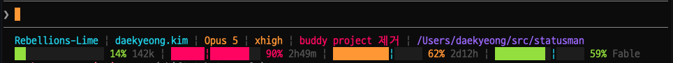

# statusman



A two-line Claude Code statusline.

Node 18 or newer, and nothing else: no runtime dependencies. Rendering a line
reads no network — the one request statusman makes, for the usage snapshot the
model-scoped cap comes from, runs in the background (see
[Where the numbers come from](#where-the-numbers-come-from)).

## Install

statusman is a Claude Code plugin. Add the marketplace, install the plugin, then
let it write the `statusLine` setting:

```
/plugin marketplace add rebel-daekyeong/statusman
/plugin install statusman@statusman
/statusman:install
```

The first two also work from a shell:

```
claude plugin marketplace add rebel-daekyeong/statusman
claude plugin install statusman@statusman
```

Installing the plugin brings the `/statusman` commands with it;
`/statusman:install` is the one that points Claude Code at the statusline
itself. Without the marketplace, a clone does the same:

```
git clone https://github.com/rebel-daekyeong/statusman
node statusman/install.js
```

Either way `statusLine` goes into `~/.claude/settings.json`, after the file is
copied to `~/.claude/statusman/claude-settings.bak.json`. It sets `padding: 0`,
which is what lines the statusline up with the rest of Claude Code's output.

To go back:

```
cp ~/.claude/statusman/claude-settings.bak.json ~/.claude/settings.json
```

Updating later is `/plugin marketplace update statusman`, and removing it is
`/plugin uninstall statusman@statusman` — the statusline setting stays until the
backup is restored.

## Files

Everything statusman writes lives in one directory of its own:

| Path | What |
|---|---|
| `~/.claude/statusman/settings.json` | which components are on, and the line count |
| `~/.claude/statusman/usage-cache.json` | the usage snapshot `refresh.js` fetches |
| `~/.claude/statusman/usage-cache.json.lock` | held while a fetch is out |
| `~/.claude/statusman/claude-settings.bak.json` | Claude Code's settings as they were before `install.js` |

Missing directories are created on the way, so nothing has to be set up by hand.
`$STATUSMAN_CONFIG` and `$STATUSMAN_USAGE_CACHE` move the first two elsewhere,
and `$CLAUDE_CONFIG_DIR` moves the lot.

The files statusman only reads stay where Claude Code keeps them:
`~/.claude.json` for the account, `~/.claude/.credentials.json` for the OAuth
token, and `~/.claude/settings.json`, which `install.js` writes `statusLine`
into.

## Components

The statusline is a list of components. Each has an id, knows which line it
belongs on in either layout, and knows how to render itself into the columns it
is given.

| id | 2-line | 4-line | shows | color |
|---|---|---|---|---|
| `org` | 1 | 1 | organization | cyan |
| `account` | 1 | 1 | account, the local part of the email | cyan |
| `model` | 1 | 1 | model display name | yellow |
| `effort` | 1 | 1 | effort level | yellow |
| `session` | 1 | 2 | session name | magenta |
| `cwd` | 1 | 2 | working directory | bright blue |
| `ctx` | 2 | 3 | context window, with the tokens used | — |
| `5h` | 2 | 3 | the 5-hour window, with its countdown | — |
| `week` | 2 | 4 | the weekly window, with its countdown | — |
| `scoped` | 2 | 4 | the model-scoped weekly cap, named by model | — |

Model and effort share a color because they describe one thing: what is
answering. Gauge bars are colored by level — yellow at 60%, red at 85%.

Switch them on and off with `/statusman`:

```
/statusman list
/statusman off scoped cwd
/statusman on scoped
/statusman toggle org
```

The state lives in `~/.claude/statusman/settings.json` (`$STATUSMAN_CONFIG`
overrides it) as a list of the ids that are off. The same thing from the shell:

```
node statusline.js --list
node statusline.js --off scoped cwd
```

## Two lines or four

Two is the default. Four splits each line in half, so every component gets
about twice the columns — worth it on a narrow terminal, or when the bars are
what you are watching.

```
/statusman lines 4
```

```
Rebellions-Lime | daekyeong.kim | Opus 5 | xhigh
statusline-wrapper 상태 표시 포팅 | /Users/daekyeong/src/statusman
█████░░░░░░░░░░░░░░░ 24% 240k | ████|██████░░░░░░░░░ 56% 3h59m
████████████|░░░░░░░ 58% 2d11h | ███████████░|░░░░░░░ 54% Fable
```

Both gauge rows are laid out together, so one bar width covers all four gauges
even though the rows carry different trailers. Laid out row by row they would
land a column or two apart and the block would read as ragged.

## How they react to the terminal width

Every component gets a column budget and adapts to it rather than letting
Claude Code truncate the line:

- **Text** clips its tail at an ellipsis, and drops out when it has no room at
  all: `statusline-w…`.
- **The working directory** rewrites itself from the front, a whole path
  segment at a time, so what survives is the end that identifies it:
  `…/src/statusman`. It takes whatever the rest of line 1 leaves over.
- **Gauges** shed child views, all of them together so the columns stay lined
  up. Bars first stretch to fill their row at one shared width; once that width
  would fall under five cells the bars go, because a two-block stub says
  nothing the percentage does not. Next to go are the trailers. Only when even
  bare percentages overflow are gauges dropped, from the right.

```
[119] ███░░░░░░░░░░░░░ 16% 162k | ██|████░░░░░░░░░ 42% 4h6m | ...
[ 90] █░░░░░░░░ 16% 162k | █|██░░░░░ 42% 4h6m | █████|░░░ 56% 2d11h | ...
[ 70] 16% 162k | 42% 4h6m | 56% 2d11h | 54% Fable
[ 40] 16% | 42% | 56% | 54%
```

On the timed gauges the `|` marks how much of the window has already run, so
fill sitting left of the tick means the budget is outlasting the clock.

Wide characters count as two columns, so a Korean session name does not push
the line past the edge.

## Where the numbers come from

| Field | Source |
|---|---|
| org, account | `~/.claude.json` -> `oauthAccount` |
| model, effort, session name, working directory, ctx, 5h, week | the statusline JSON on stdin |
| 5h, week when stdin has no `rate_limits` | a cached `/api/oauth/usage` snapshot |
| the model-scoped weekly cap | that cache only — stdin never carries it |

The cache is `$STATUSMAN_USAGE_CACHE`, or `~/.claude/statusman/usage-cache.json`.
`refresh.js` writes it and is the only part of statusman that touches the
network:

```
node refresh.js
```

It reads the signed-in account's OAuth token — the login keychain on macOS,
`~/.claude/.credentials.json` elsewhere — and `GET`s `/api/oauth/usage`, the
same undocumented endpoint `/usage` reads. Nothing but that token goes out, and
it goes only to `api.anthropic.com`.

Rendering never waits for it. When the snapshot is missing or more than ten
minutes old, the statusline spawns `refresh.js` detached and draws from the
snapshot it already has; the next render picks up the new one. A lock file
beside the cache keeps the redraws in between from starting a second request,
and a request that fails — an expired token, an unreachable API — leaves the old
snapshot in place. With `scoped` switched off nothing in the snapshot is still
needed, so no request is made at all.

With no snapshot the `scoped` gauge is absent and, if stdin also lacks
`rate_limits`, so are `5h` and `week`.

`scoped` falls back to purchased extra-usage credits when the account has no
scoped cap but does have credits. An account with neither — extra usage switched
off at the org level, say — gets three gauges, not a fourth reading "off".

`session` falls back to the working directory's basename until the session is
actually named.

Terminal width comes from `$COLUMNS`, which Claude Code passes down; override it
with `$STATUSMAN_COLUMNS`. Four columns are held back for the indent Claude Code
draws around the statusline — without that the last gauge's trailer gets
truncated away. `$COLUMNS` is the width the shell had at launch, so a resized
window keeps the old layout until the next Claude Code start.

A row can still stop a few columns short of the right edge. The bars share one
width, so whatever does not divide evenly between them stays unused.

## Developing

```
pnpm install                        # eslint, the only dependency, and dev-only
git config core.hooksPath .githooks  # lint and test on every commit
pnpm run check                       # eslint . && node --test test/*.test.js
```

75 tests over nine files cover column measurement, the number formats, which
source wins for each field, both layouts and what gives way as the terminal
narrows, switching components off, the settings file, the installer's backup,
the usage fetch against a local server, and the script as Claude Code actually
runs it. See [CONTRIBUTING.md](CONTRIBUTING.md) for the coding
convention and how to add a component.

## License

MIT — see [LICENSE](LICENSE). Changes are listed in
[CHANGELOG.md](CHANGELOG.md).
